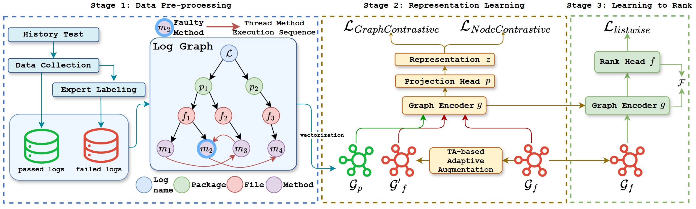
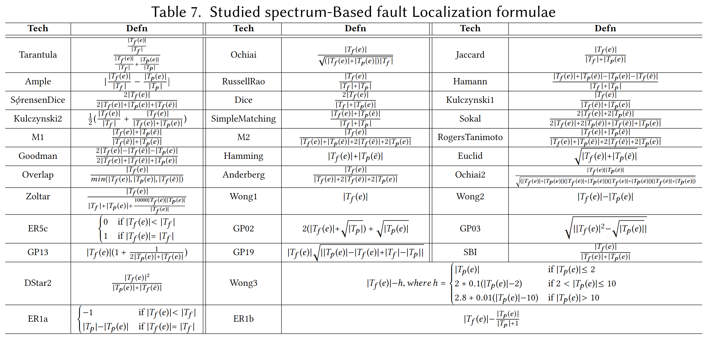

# Falcon

  

<em>Falcon (<b>Fa</b>u<b>l</b>t lo<b>c</b>alizati<b>on</b>) </em>

This repo contains the overview and all experimental data for 34 spectrum-based fault localization techniques from the paper [Enhancing Fault Localization in Industrial Software Systems via Contrastive Learning]() (ICSE'25).

## Overview

Falcon consists of three main stages: Data Pre-processing, Representation Learning, and Learning to Rank. For a more detailed description, please refer to Section III of our paper.

## Additional experimental data for SBFL

Due to spatial constraints, only the three SBFL formulae with top performance--RussellRao, Hamann, and SφrensenDice--are highlighted in Table Ⅲ nad Table Ⅳ, while comprehensive results are accessible on this repo.

We present the performance of all 34 spectrum-based fault localization methods in Top-1, Top-3, Top-5, MFR, MRR at both file and method levels in 'data.xlsx'.

The detailed information on these SBFL formulae are shown below.

This table is sourced from Table 7 in the paper "Transforming Programs and Tests in Tandem for Fault Localization."
All the proposed formulae in this image rely on the following information:
1. the set of all failed/passed tests, i.e., $T_f/T_p$
2. the set of failed/passed tests executing element $e$, i.e., $T_f(e)/T_p(e)$
3. the set of failed/passed tests that do not execute element $e$, i.e., $T_f(\bar{e})/T_p(\bar{e})$

For example, the suspicioussness score of element e based on Jaccard formula will be calculated as $\frac{|T_f(e)|}{|T_f|+T_p(e)}$.